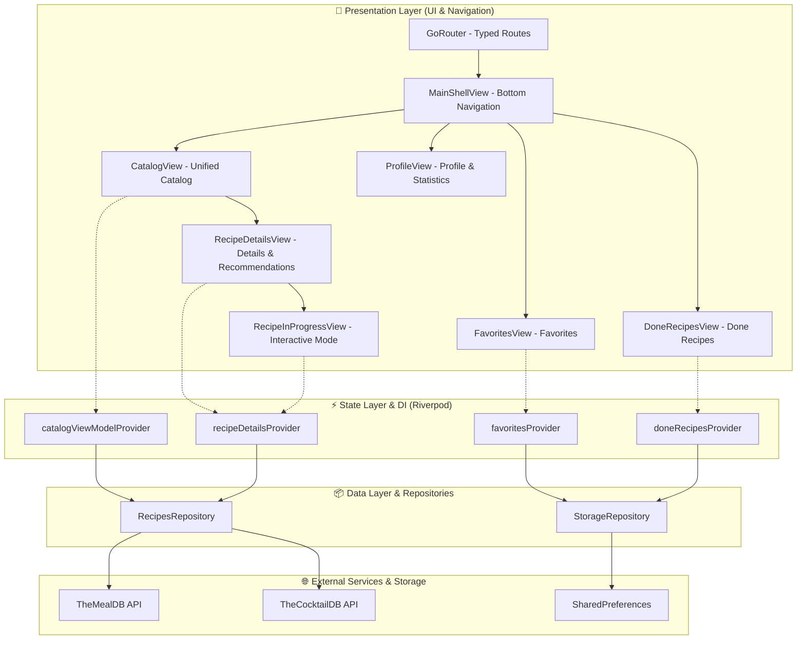

# 🍳 GourmetLab — Recipes & Drinks Mobile App

[](https://flutter.dev/)
[](https://dart.dev/)
[](https://riverpod.dev/)
[](https://pub.dev/packages/dio)
[](https://pub.dev/packages/go_router)
[](https://opensource.org/licenses/MIT)

> [**Versão em Português**](README.md) | 🇺🇸 **English**

**GourmetLab** is a native mobile application developed in Flutter designed for worldwide culinary and cocktail exploration. The app features real-time data consumption from public APIs (**TheMealDB** and **TheCocktailDB**), decoupled state management and dependency injection via **Riverpod**, declarative routing with **GoRouter**, persistent local storage using **SharedPreferences**, an interactive step-by-step cooking mode (with persistent checklist), and a refined design system in deep purple `#41197F` and gold `#FCC436`.

## 📌 Quick Navigation

- [📝 About the Project](#-about-the-project)
- [👥 Project Origin and Background](#-project-origin-and-background)
- [🖼️ Preview](#️-preview)
- [⚡ API Endpoints](#-api-endpoints)
- [✨ Features](#-features)
- [🛠️ Technologies and Tools](#️-technologies-and-tools)
- [🏛️ Solution Architecture](#️-solution-architecture)
- [📁 Repository Structure](#-repository-structure)
- [💡 Technical Decisions](#-technical-decisions)
- [🚀 How to Run the Project](#-how-to-run-the-project)
- [📄 License](#-license)

## 📝 About the Project

**GourmetLab** was built to deliver a smooth, immersive, and responsive mobile experience for cooking and cocktail enthusiasts. It allows users to search recipes by ingredients, names, or first letter, filter by categories using a horizontal carousel, save favorite items, track recipes in progress through a persistent interactive checklist, and explore cross-gastronomic recommendations.

The visual identity was designed following Material 3 guidelines with modern typography (*Plus Jakarta Sans*), micro-animations, skeleton shimmer loading effects, and native haptic feedback (`HapticFeedback`).

## 👥 Project Origin and Background

This mobile application is an evolution and recreation in **native Flutter** based on the original web application project available at:  
🔗 [**ludson96/project-recipes-app**](https://github.com/ludson96/project-recipes-app)

### 🔄 From Web to Native Mobile
- **Original Web Project**: Initially developed in React 18 with TypeScript, Tailwind CSS, and Context API during web development training. The web version simulated a smartphone screen in the browser interface through a device frame with Dynamic Island and a mock status bar.
- **Evolution to Native Mobile App**: Complete recreation of the solution as a 100% native **Flutter** mobile application, removing artificial screen frames and leveraging native Android and iOS capabilities (smooth sliver scrolling, hardware acceleration, haptic vibration feedback, clean reactive injection with **Riverpod** replacing GetIt and Context API, and local storage persistence).

## 🖼️ Preview


## ⚡ API Endpoints

The application consumes two specialized open databases via the **Dio** HTTP client:

### 🍽️ TheMealDB API (`https://www.themealdb.com/api/json/v1/1`)
- `GET /search.php?s={name}` — Search meals by name and initial listing.
- `GET /filter.php?i={ingredient}` — Filter meals by main ingredient.
- `GET /search.php?f={letter}` — Search meals by first letter.
- `GET /filter.php?c={category}` — Filter by meal categories (*Beef, Chicken, Dessert, etc.*).
- `GET /lookup.php?i={id}` — Full meal details with ingredients, measures, instructions, and YouTube video link.
- `GET /list.php?c=list` — Category list for quick filter chips.

### 🍸 TheCocktailDB API (`https://www.thecocktaildb.com/api/json/v1/1`)
- `GET /search.php?s={name}` / `GET /search.php?f=a` — Search cocktails by name and resilient initial fallback.
- `GET /filter.php?i={ingredient}` — Filter drinks by ingredient.
- `GET /search.php?f={letter}` — Search drinks by first letter.
- `GET /filter.php?c={category}` — Drink categories (*Ordinary Drink, Cocktail, Shake, etc.*).
- `GET /lookup.php?i={id}` — Drink details with preparation instructions and recommended glassware.
- `GET /list.php?c=list` — Category list for quick filters.

## ✨ Features

- 🔐 **Simple Auth & Session**: Visual validation of email and password with local session persistence.
- 🥘 **Unified Catalog (Meals & Cocktails)**: Instant toggle between food recipes (*TheMealDB*) and drink recipes (*TheCocktailDB*).
- 🔍 **Smart Search Bar**: Multi-criteria search by recipe name, main ingredient, or first letter.
- 🏷️ **Category Filters**: Horizontal carousel of quick filter chips with dynamic select/deselect toggle support.
- 📖 **Comprehensive Recipe Details**: Immersive `SliverAppBar` banner, Hero image animation, dynamically extracted ingredient and measure list, detailed preparation steps, YouTube video launcher via `url_launcher`, and cross-recommendation carousel (meals recommend drinks and vice-versa).
- ⏱️ **Interactive Cooking Mode**: Interactive checklist that crosses out used ingredients, persists progress in real-time, displays a progress bar (0% to 100%), and unlocks the finish button only upon 100% completion.
- ❤️ **Favorites Management**: Add/remove favorite recipes with haptic feedback animation and persistent local storage.
- 📜 **Done Recipes History**: Automatic log of completed recipes with finish date and tags.
- 🔗 **Native Sharing**: Instant recipe link sharing via `share_plus` across system apps.
- 👤 **Profile Screen**: User dashboard with culinary metrics (total favorited and finished recipes) and Logout action.

## 🛠️ Technologies and Tools

| Layer / Purpose | Technology | Description |
| :--- | :--- | :--- |
| **Primary Language** | **Dart 3.10+** | Strong typing, null-safety, and modern functional features |
| **UI Framework** | **Flutter 3.x** | High-performance reactive native mobile UI building |
| **State Management & DI** | **Flutter Riverpod 3.3.2** | Dependency Injection without GetIt, reactive state, and immutable providers |
| **Declarative Routing** | **GoRouter 17.5.0** | Typed routing with `StatefulShellRoute` and nested tabs support |
| **HTTP Client** | **Dio 5.11.1** | Asynchronous HTTP requests with resilient error handling and timeouts |
| **Local Persistence** | **SharedPreferences 2.5.5** | Storage for favorites, in-progress steps, and user session |
| **Cached Images & Shimmer** | **CachedNetworkImage 3.4.1 & Shimmer 3.0.0** | Image caching and skeleton effect during data loading |
| **Typography & Styling** | **Google Fonts 8.2.1** | *Plus Jakarta Sans* font integrated into Material 3 design system |
| **External Integration & Share** | **SharePlus 13.3.0 & UrlLauncher 6.3.2** | Native sharing dialogs and external YouTube video playback |
| **Automated Testing** | **Flutter Test** | Unit and widget tests validating models, parsing, and rendering |

## 🏛️ Solution Architecture

The project follows a **Feature-First** architecture pattern (layers organized by business feature), promoting low coupling, high cohesion, and maintainability:



## 📁 Repository Structure

```
recipes_app/
├── android/                        # Android native configurations
├── ios/                            # iOS native configurations
├── lib/
│   ├── core/
│   │   ├── network/                # Dio client providers for Meals & Drinks
│   │   ├── router/                 # GoRouter configuration & MainShellView
│   │   ├── storage/                # Persistence repository & storage providers
│   │   └── theme/                  # GourmetLab palette, typography & themes
│   ├── features/
│   │   ├── auth/                   # Login views & session validation
│   │   ├── done_recipes/           # Completed recipes history view
│   │   ├── favorites/              # Favorites view & filters
│   │   ├── profile/                # Profile view & culinary metrics
│   │   ├── recipe_details/         # Recipe details, recommendations & checklist
│   │   └── recipes/                # Catalog, recipe cards, category chips & search
│   └── main.dart                   # Application entry point with ProviderScope
├── test/
│   └── widget_test.dart            # Unit & widget tests
├── pubspec.yaml                    # Flutter dependencies & assets
└── README.md                       # Project documentation
```

## 💡 Technical Decisions

- **Riverpod as Unified Injector & State Manager**: Riverpod replaces the need for `GetIt` by providing native Dependency Injection and reactive state management in one place. It guarantees automated lifecycle handling, compile-time safety, and effortless test mocking.
- **Dynamic 20-Ingredient Parsing**: TheMealDB and TheCocktailDB return ingredients and measures as separate keys from `strIngredient1..20` and `strMeasure1..20`. The [`RecipeModel`](lib/features/recipes/models/recipe_model.dart) processes these keys dynamically into a clean, strongly-typed `List<IngredientItem>`.
- **Interactive Cooking Mode with Persistent Checklist**: Allows home cooks to tick off ingredients step-by-step with real-time saving and button locking until 100% completion.
- **Cross-Gastronomic Recommendations**: Meals recommend cocktail pairings, while drink details recommend food recipes from the catalog.
- **Lightweight Offline Persistence**: `SharedPreferences` provides frictionless persistence for favorites, finished recipes, and in-progress steps without relational database overhead.

## 🚀 How to Run the Project

### Prerequisites
- [Flutter SDK](https://docs.flutter.dev/get-started/install) installed (version 3.10 or higher)
- [Dart SDK](https://dart.dev/get-dart)
- Android / iOS emulator or connected physical device
- Git

### Step by Step

1. **Clone the repository:**
```bash
git clone https://github.com/ludson96/project-recipes-app.git
cd project-recipes-app/recipes_app
```

2. **Install Flutter dependencies:**
```bash
flutter pub get
```

3. **Run automated tests:**
```bash
flutter test
```

4. **Launch the application:**
```bash
flutter run
```

## 📄 License

This project is licensed under the **MIT License**. See the [LICENSE](LICENSE) file for details.

<div align="center">
  Developed by <strong>Ludson Pereira dos Santos</strong> 🚀<br />
  <a href="https://www.linkedin.com/in/ludson96/">LinkedIn</a> • <a href="https://github.com/ludson96">GitHub</a> • <a href="mailto:ludson_ps27@hotmail.com">Email</a>
</div>
