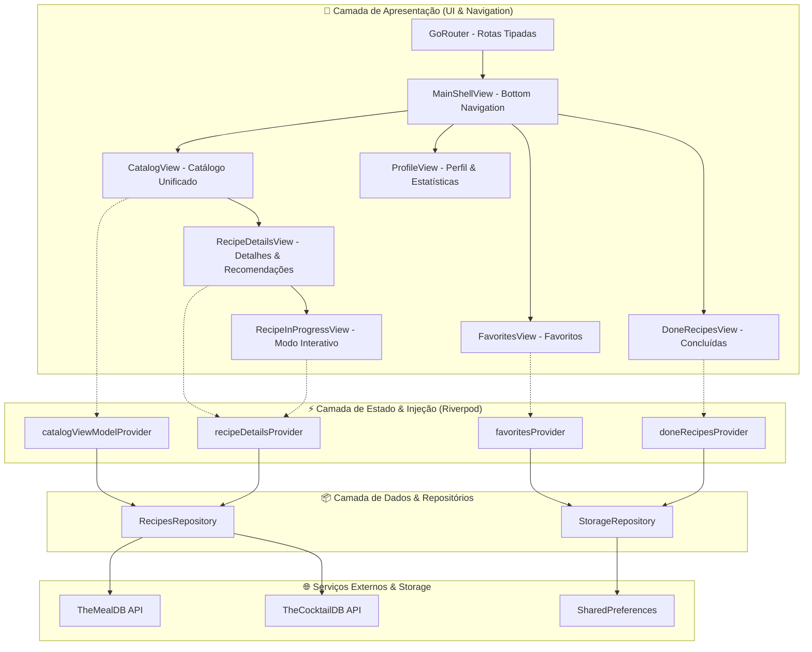

# 🍳 GourmetLab — Receitas & Drinks Mobile App

[](https://flutter.dev/)
[](https://dart.dev/)
[](https://riverpod.dev/)
[](https://pub.dev/packages/dio)
[](https://pub.dev/packages/go_router)
[](https://opensource.org/licenses/MIT)

> 🇧🇷 **Português** | 🇺🇸 [**English Version**](README.en.md)

O **GourmetLab** é um aplicativo mobile nativo desenvolvido em Flutter voltado à exploração culinária e coquetelaria mundial. O app conta com consumo em tempo real das APIs públicas **TheMealDB** e **TheCocktailDB**, gerenciamento de estado e injeção de dependências desacoplada com **Riverpod**, navegação declarativa via **GoRouter**, persistência local de dados com **SharedPreferences**, modo interativo de preparo passo a passo (com checklist persistente) e um design system refinado nas cores `#41197F` e dourado `#FCC436`.

## 📌 Navegação Rápida

- [📝 Sobre o Projeto](#-sobre-o-projeto)
- [👥 Origem e Histórico do Projeto](#-origem-e-histórico-do-projeto)
- [🖼️ Preview](#️-preview)
- [⚡ API Endpoints](#-api-endpoints)
- [✨ Funcionalidades](#-funcionalidades)
- [🛠️ Tecnologias e Ferramentas Utilizadas](#️-tecnologias-e-ferramentas-utilizadas)
- [🏛️ Arquitetura da Solução](#️-arquitetura-da-solução)
- [📁 Estrutura do Repositório](#-estrutura-do-repositório)
- [💡 Decisões Técnicas](#-decisões-técnicas)
- [🚀 Como Executar o Projeto](#-como-executar-o-projeto)
- [📄 Licença](#-licença)

## 📝 Sobre o Projeto

O **GourmetLab** foi construído com o objetivo de oferecer uma experiência móvel fluida, imersiva e responsiva para apaixonados por culinária e coquetéis. Ele permite pesquisar receitas por ingredientes, nomes ou primeira letra, filtrar por categorias em carrossel horizontal, salvar itens favoritos, acompanhar receitas em andamento através de um checklist interativo persistente e visualizar recomendações gastronômicas cruzadas.

A identidade visual foi projetada seguindo as diretrizes do Material 3 com tipografia moderna (*Plus Jakarta Sans*), micro-animações, carregamento com efeito shimmer skeleton e feedback tátil por vibração nativa (`HapticFeedback`).

## 👥 Origem e Histórico do Projeto

Este aplicativo móvel é uma evolução e recriação em **Flutter nativo** baseada no projeto original de aplicação web disponível em:  
🔗 [**ludson96/project-recipes-app**](https://github.com/ludson96/project-recipes-app)

### 🔄 Da Web ao Mobile Nativo
- **Projeto Web Original**: Desenvolvido inicialmente em React 18 com TypeScript, Tailwind CSS e Context API durante a formação em desenvolvimento web. A versão web simulava uma tela de smartphone na interface do navegador por meio de uma moldura com Dynamic Island e barra de status fictícia.
- **Evolução para o App Mobile**: Recriação completa da solução para um aplicativo mobile 100% nativo em **Flutter**, eliminando molduras artificiais e aproveitando os recursos nativos dos sistemas Android e iOS (gestos de rolagem suave com slivers, aceleração de hardware, feedback háptico tátil, injeção reativa limpa com **Riverpod** em substituição ao GetIt e Context API, e persistência em storage local).

## 🖼️ Preview


## ⚡ API Endpoints

A aplicação consome duas bases de dados abertas especializadas por meio do cliente HTTP **Dio**:

### 🍽️ TheMealDB API (`https://www.themealdb.com/api/json/v1/1`)
- `GET /search.php?s={name}` — Pesquisa de pratos culinários por nome e listagem inicial.
- `GET /filter.php?i={ingredient}` — Filtro de receitas pelo ingrediente principal.
- `GET /search.php?f={letter}` — Busca de refeições pela primeira letra.
- `GET /filter.php?c={category}` — Filtragem por categorias gastronômicas (*Beef, Chicken, Dessert, etc.*).
- `GET /lookup.php?i={id}` — Detalhes completos da refeição com ingredientes, medidas, instruções e link de vídeo do YouTube.
- `GET /list.php?c=list` — Lista de categorias para os botões de filtro rápido.

### 🍸 TheCocktailDB API (`https://www.thecocktaildb.com/api/json/v1/1`)
- `GET /search.php?s={name}` / `GET /search.php?f=a` — Pesquisa de coquetéis por nome e carregamento inicial resiliente.
- `GET /filter.php?i={ingredient}` — Filtragem de drinks por ingrediente.
- `GET /search.php?f={letter}` — Busca de bebidas pela primeira letra.
- `GET /filter.php?c={category}` — Categorias de drinks (*Ordinary Drink, Cocktail, Shake, etc.*).
- `GET /lookup.php?i={id}` — Detalhes do drink com modo de preparo e copos recomendados.
- `GET /list.php?c=list` — Listagem de categorias para os filtros rápidos.

## ✨ Funcionalidades

- 🔐 **Autenticação Simples & Sessão**: Validação visual de e-mail e senha com persistência dos dados de acesso localmente.
- 🥘 **Catálogo Unificado (Pratos & Coquetéis)**: Alternador instantâneo entre o universo de comidas (*TheMealDB*) e bebidas (*TheCocktailDB*).
- 🔍 **Barra de Pesquisa Inteligente**: Busca multi-critério por nome da receita, ingrediente principal ou primeira letra.
- 🏷️ **Filtros por Categorias**: Carrossel horizontal de filtros rápidos com suporte a seleção e desseleção dinâmica (*toggle*).
- 📖 **Página de Detalhes Completa**: Banner imersivo com `SliverAppBar`, imagem com animação Hero, lista unificada de ingredientes e proporções extraídas dinamicamente, modo de preparo detalhado, integração com vídeos do YouTube via `url_launcher` e carrossel de recomendações cruzadas (comidas sugerem coquetéis e vice-versa).
- ⏱️ **Modo Receita em Progresso (Interactive Cooking Mode)**: Checklist interativo que risca os ingredientes já utilizados, salva o progresso em tempo real e calcula a barra de conclusão percentual (0 a 100%), liberando a finalização somente após todos os passos concluídos.
- ❤️ **Gestão de Favoritos**: Adicionar e remover receitas dos favoritos com animação de feedback háptico e persistência local.
- 📜 **Histórico de Receitas Concluídas**: Registro automático das receitas finalizadas com data de conclusão e tags.
- 🔗 **Compartilhamento Nativo**: Compartilhamento instantâneo de receitas via `share_plus` em apps do sistema.
- 👤 **Área de Perfil**: Painel com métricas culinárias (total de receitas favoritadas e concluídas) e ação de encerramento de sessão (*Logout*).

## 🛠️ Tecnologias e Ferramentas Utilizadas

| Camada / Finalidade | Tecnologia | Descrição |
| :--- | :--- | :--- |
| **Linguagem Principal** | **Dart 3.10+** | Tipagem forte, null-safety e recursos funcionais modernos |
| **Framework UI** | **Flutter 3.x** | Construção de interfaces mobile nativas reativas de alta performance |
| **Gerenciamento de Estado & DI** | **Flutter Riverpod 3.3.2** | Injeção de dependências sem GetIt, controle reativo e Providers imutáveis |
| **Roteamento Declarativo** | **GoRouter 17.5.0** | Roteamento tipado com suporte a `StatefulShellRoute` e abas aninhadas |
| **Cliente HTTP** | **Dio 5.11.1** | Requisições assíncronas com tratamento resiliente e timeout configurado |
| **Persistência Local** | **SharedPreferences 2.5.5** | Armazenamento de favoritos, passos em progresso e sessão de usuário |
| **Imagens em Cache & Shimmer** | **CachedNetworkImage 3.4.1 & Shimmer 3.0.0** | Cache de fotos e efeito esqueleto durante o carregamento de dados |
| **Tipografia & Estilização** | **Google Fonts 8.2.1** | Aplicação da fonte *Plus Jakarta Sans* integrada ao design system Material 3 |
| **Integração Externa & Share** | **SharePlus 13.3.0 & UrlLauncher 6.3.2** | Compartilhamento nativo e acionamento de links de vídeos no YouTube |
| **Testes Automatizados** | **Flutter Test** | Testes de unidade e widgets validando modelos, parsing e renderização |

## 🏛️ Arquitetura da Solução

O projeto segue o padrão arquitetural **Feature-First** (camadas organizadas por funcionalidade), promovendo baixo acoplamento, alta coesão e facilidade de manutenção:



## 📁 Estrutura do Repositório

```
recipes_app/
├── android/                        # Configurações nativas do Android
├── ios/                            # Configurações nativas do iOS
├── lib/
│   ├── core/
│   │   ├── network/                # Provedores Dio para Meals e Drinks
│   │   ├── router/                 # Configurações do GoRouter e MainShellView
│   │   ├── storage/                # Repositório de persistência e Providers
│   │   └── theme/                  # Paleta GourmetLab, tipografia e temas
│   ├── features/
│   │   ├── auth/                   # Telas de login e validação de sessão
│   │   ├── done_recipes/           # Tela de histórico de receitas concluídas
│   │   ├── favorites/              # Tela e filtros de receitas favoritas
│   │   ├── profile/                # Tela de perfil e métricas culinárias
│   │   ├── recipe_details/         # Detalhes, recomendações e checklist em progresso
│   │   └── recipes/                # Catálogo, cards, chips de categorias e busca
│   └── main.dart                   # Ponto de entrada com ProviderScope e inicialização
├── test/
│   └── widget_test.dart            # Testes de unidade e testes de widgets
├── pubspec.yaml                    # Dependências e assets do projeto
└── README.md                       # Documentação do projeto
```

## 💡 Decisões Técnicas

- **Riverpod como Injetor e Gerenciador de Estado Único**: O Riverpod unifica a Injeção de Dependências (DI) e o Gerenciamento de Estado sem necessidade de pacotes adicionais como o `GetIt`. Ele garante controle de ciclo de vida automático, facilidade de mock em testes e detecção de dependências em tempo de compilação.
- **Parsing Dinâmico dos 20 Ingredientes das APIs**: As APIs TheMealDB e TheCocktailDB retornam ingredientes e medidas espalhados em propriedades de `strIngredient1` a `strIngredient20` e `strMeasure1` a `strMeasure20`. O modelo [`RecipeModel`](lib/features/recipes/models/recipe_model.dart) processa essas chaves dinamicamente, transformando-as em uma lista limpa e tipada de `IngredientItem`.
- **Modo de Preparo com Checklist Interativo**: Para tornar o aplicativo um verdadeiro companheiro na cozinha, os ingredientes podem ser marcados como concluídos individualmente, com salvamento do progresso em tempo real e trava do botão de conclusão até que 100% da receita esteja pronta.
- **Recomendações Gastronômicas Cruzadas**: A página de detalhes de um prato sugere coquetéis para harmonização, enquanto os detalhes de um coquetel recomendam refeições do catálogo.
- **Persistência Sem Overhead**: Utilização do `SharedPreferences` para armazenar a lista de favoritos, as receitas feitas e o progresso em andamento sem a complexidade de bancos relacionais locais pesados.

## 🚀 Como Executar o Projeto

### Pré-requisitos
- [Flutter SDK](https://docs.flutter.dev/get-started/install) instalado (versão 3.10 ou superior)
- [Dart SDK](https://dart.dev/get-dart)
- Emulador Android / iOS ou dispositivo físico configurado
- Git

### Passo a Passo

1. **Clone o repositório:**
```bash
git clone https://github.com/ludson96/project-recipes-app.git
cd project-recipes-app/recipes_app
```

2. **Instale as dependências do Flutter:**
```bash
flutter pub get
```

3. **Execute os testes automatizados:**
```bash
flutter test
```

4. **Inicie o aplicativo no emulador ou dispositivo conectado:**
```bash
flutter run
```

## 📄 Licença

Este projeto está distribuído sob a licença **MIT**. Consulte o arquivo [LICENSE](LICENSE) para obter mais informações.

<div align="center">
  Desenvolvido por <strong>Ludson Pereira dos Santos</strong> 🚀<br />
  <a href="https://www.linkedin.com/in/ludson96/">LinkedIn</a> • <a href="https://github.com/ludson96">GitHub</a> • <a href="mailto:ludson_ps27@hotmail.com">E-mail</a>
</div>